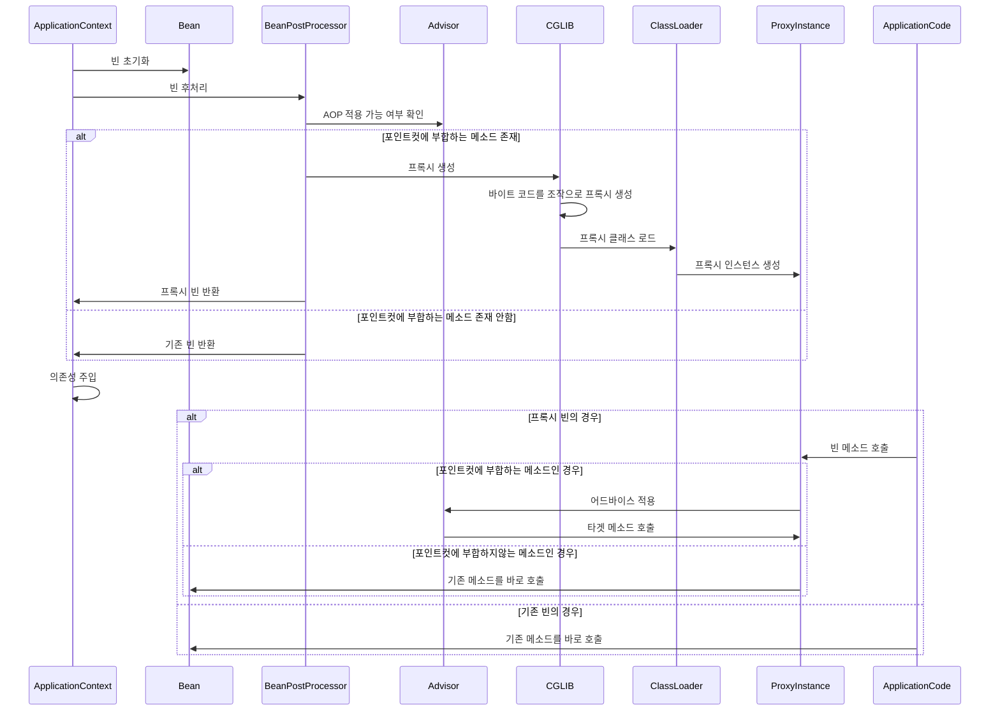

### 스프링 AOP와 CGLIB 프록시 생성 순서

1. **빈 초기화**
    - 스프링 컨텍스트가 빈을 생성하고 초기화합니다.

2. **빈 후처리**
    - `BeanPostProcessor`가 빈을 후처리하고, AOP 적용 여부를 검사합니다.

3. **포인트컷 평가**
    - 어드바이저의 포인트컷 조건에 따라 빈의 메서드가 AOP 적용 대상인지 평가합니다.

4. **프록시 생성**
    - 포인트컷 조건에 부합하는 메서드가 하나라도 있다면, CGLIB을 사용하여 런타임에 바이트코드를 조작하여 프록시 클래스를 생성합니다.
    - **바이트코드 생성**: CGLIB은 원본 클래스의 바이트코드를 분석하고, 이를 기반으로 프록시 클래스의 바이트코드를 생성합니다.
    - **클래스 로딩**: 생성된 프록시 클래스의 바이트코드는 자바의 클래스 로더를 통해 메모리에 로드됩니다. 이 클래스 로더는 JVM의 일부로, 런타임에 새로운 클래스를 로드하고 관리합니다.
    - **프록시 인스턴스 생성**: 로드된 프록시 클래스를 통해 프록시 객체가 생성됩니다. 이 프록시 객체는 원본 클래스를 상속받아 동작합니다.
    - 생성된 프록시 클래스는 포인트컷에 부합하는 메서드 호출을 가로채고, 어드바이스를 적용한 후 원본 메서드를 호출합니다.

5. **프록시 등록**
    - 스프링 컨텍스트는 의존성 주입 시 원본 빈 대신 프록시 빈을 주입합니다.
    - 이를 통해 AOP 적용 대상 빈의 모든 메서드 호출이 프록시를 통해 이루어지게 됩니다.

6. **메서드 호출**
    - 애플리케이션 코드에서 빈의 메서드를 호출하면, 프록시가 메서드 호출을 가로채고 포인트컷 조건을 평가합니다.
    - 조건에 부합하는 경우 어드바이스를 적용하고, 이후 원본 메서드를 호출합니다.

