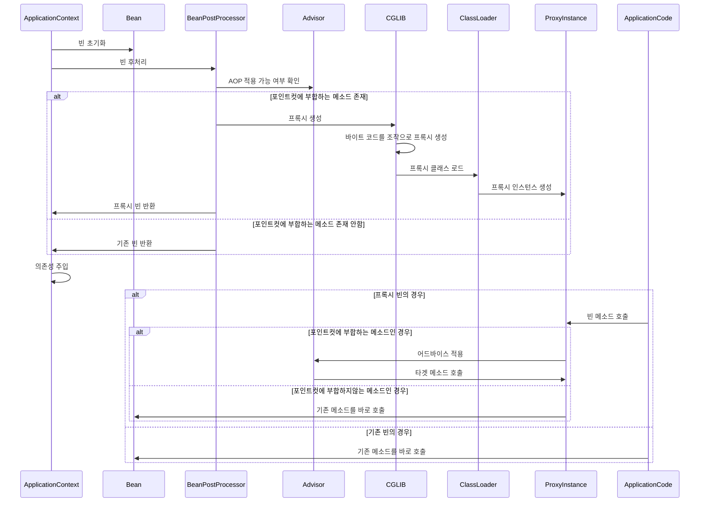

# 실무에서 만난 글로벌 롤백 마킹

## 개요

스프링의 트랜잭션 글로벌 롤백 마킹으로 인해 예상하지 못한 동작에 대한 경험을 기록합니다.


## 어떤 문제가 있었나?

스프링 부트 배치를 통해서, 자동적으로 심사가 마친 상품들에 대해서 상태를 온세일로 변경하는 배치를 개발하고 있었습니다.

이 때, 상품이 온세일되기 위해서는 여러가지 벨리데이션이 필요합니다.

배치를 개발할 때, 벨리데이션에서 실패한 상품은 슬랙 메세지를 전송하고, 다음 상품을 다시 온세일 시도하길 기대했습니다.

하지만 실제로는 모든 청크의 상태 변경이 실패하는 일이 발생합니다.

## 기존의 코드

기존의 코드는 아래와 같습니다.

```java
override fun write(items: MutableList<out Product>) {
        items.forEach {
            try {
                productService.updateStatus(
                    productId = it.id,
                    status = ProductStatus.ONSALE,
                    reason = reason
                )
                ...
            } catch (e: Exception) {
                ...
            }
        }
    }
```

```java
@Service
@Transactional
class ProductService(
   ...
) {
    fun update(...) {
      ...
    }
```

기본적으로 chunkOrientedTasklet은 청크 단위로 트랜잭션이 걸립니다.

그래서 청크 단위로 먼저 트랜잭션을 만들고, ProductService의 update 메소드는 해당 트랜잭션에 참여할 것입니다.

ProductService의 update 메소드가 실행되고 벨리데이션에서 실패해도, 트랜잭션의 시작점인 write메소드 안에 try catch가 존재하므로 롤백 마킹이 안될 것으로 예상했습니다.

기본적으로 트랜잭션에 try catch를 거는것이 안티패턴인줄 알았으나, 비지니스의 시급도에 따라서 기능을 핫픽스로 빠르게 구현해야하는 상황이었습니다.

하지만 롤백 마킹은 이루어졌고, 모든 청크에서 실패하게됩니다.

어쩔 수 없이, 다른 방법으로 빠르게 핫픽스를 내보내게됩니다.

그리고나서 하나의 트랜잭션에서 롤백 마킹이 안일어나도록 try catch를 걸어줬음에도 롤백이 마킹된 원인이 궁금해졌습니다.

## 스프링 aop

먼저 원인을 찾기 위해서 @Transactional이 어떻게 동작하는것인지 알아볼 필요가 있습니다.

스프링의 aop는 기본적으로 CGLIB을 사용하며 아래와 같이 동작합니다.

1. **빈 초기화**
    - 스프링 컨텍스트가 빈을 생성하고 초기화합니다.

2. **빈 후처리**
    - `BeanPostProcessor`가 빈을 후처리하고, AOP 적용 여부를 검사합니다.

3. **포인트컷 평가**
    - 어드바이저의 포인트컷 조건에 따라 빈의 메서드가 AOP 적용 대상인지 평가합니다.

4. **프록시 생성**
    - 포인트컷 조건에 부합하는 메서드가 하나라도 있다면, CGLIB을 사용하여 런타임에 바이트코드를 조작하여 프록시 클래스를 생성합니다.
    - **바이트코드 생성**: CGLIB은 원본 클래스의 바이트코드를 분석하고, 이를 기반으로 프록시 클래스의 바이트코드를 생성합니다.
    - **클래스 로딩**: 생성된 프록시 클래스의 바이트코드는 자바의 클래스 로더를 통해 메모리에 로드됩니다. 이 클래스 로더는 JVM의 일부로, 런타임에 새로운 클래스를 로드하고 관리합니다.
    - **프록시 인스턴스 생성**: 로드된 프록시 클래스를 통해 프록시 객체가 생성됩니다. 이 프록시 객체는 원본 클래스를 상속받아 동작합니다.
    - 생성된 프록시 클래스는 포인트컷에 부합하는 메서드 호출을 가로채고, 어드바이스를 적용한 후 원본 메서드를 호출합니다.

5. **프록시 등록**
    - 스프링 컨텍스트는 의존성 주입 시 원본 빈 대신 프록시 빈을 주입합니다.
    - 이를 통해 AOP 적용 대상 빈의 모든 메서드 호출이 프록시를 통해 이루어지게 됩니다.

6. **메서드 호출**
    - 애플리케이션 코드에서 빈의 메서드를 호출하면, 프록시가 메서드 호출을 가로채고 포인트컷 조건을 평가합니다.
    - 조건에 부합하는 경우 어드바이스를 적용하고, 이후 원본 메서드를 호출합니다.

@Transactional 어노테이션도 똑같습니다. 위 과정을 통해서 스프링이 부팅될 때 @Transactional 어노테이션을 탐지하고 런타임에 CGLIB이 프록시 클래스를 만듭니다.

런타임에 이미 트랜잭션 어노테이션이 동작하는 코드들은 메소드 단위로 프록싱이 되어있습니다. 즉, 메소드 단위로 어드바이스가 설정되어있습니다.

다이어그램으로 보면 아래와 같습니다.


## 그래서 문제의 원인은?

트랜잭션 어드바이스에서 동작하는 스프링의 코드들중에 AbstractPlatformTransactionManager 클래스가 있습니다.

해당 클래스에는 setGlobalRollbackOnParticipationFailure(boolean globalRollbackOnParticipationFailure) 라는 시그니처의 메소드가 있습니다. 

여기 주석을 보면 원인을 알 수 있습니다.

```java
/***
	 * Set whether to globally mark an existing transaction as rollback-only
	 * after a participating transaction failed.
	 * <p>Default is "true": If a participating transaction (e.g. with
	 * PROPAGATION_REQUIRED or PROPAGATION_SUPPORTS encountering an existing
	 * transaction) fails, the transaction will be globally marked as rollback-only.
	 * The only possible outcome of such a transaction is a rollback: The
	 * transaction originator <i>cannot</i> make the transaction commit anymore.
	 * <p>Switch this to "false" to let the transaction originator make the rollback
	 * decision. If a participating transaction fails with an exception, the caller
	 * can still decide to continue with a different path within the transaction.
	 * However, note that this will only work as long as all participating resources
	 * are capable of continuing towards a transaction commit even after a data access
	 * failure: This is generally not the case for a Hibernate Session, for example;
	 * neither is it for a sequence of JDBC insert/update/delete operations.
	 * <p><b>Note:</b>This flag only applies to an explicit rollback attempt for a
	 * subtransaction, typically caused by an exception thrown by a data access operation
	 * (where TransactionInterceptor will trigger a {@code PlatformTransactionManager.rollback()}
	 * call according to a rollback rule). If the flag is off, the caller can handle the exception
	 * and decide on a rollback, independent of the rollback rules of the subtransaction.
	 * This flag does, however, <i>not</i> apply to explicit {@code setRollbackOnly}
	 * calls on a {@code TransactionStatus}, which will always cause an eventual
	 * global rollback (as it might not throw an exception after the rollback-only call).
	 * <p>The recommended solution for handling failure of a subtransaction
	 * is a "nested transaction", where the global transaction can be rolled
	 * back to a savepoint taken at the beginning of the subtransaction.
	 * PROPAGATION_NESTED provides exactly those semantics; however, it will
	 * only work when nested transaction support is available. This is the case
	 * with DataSourceTransactionManager, but not with JtaTransactionManager.
	 * @see #setNestedTransactionAllowed
	 * @see org.springframework.transaction.jta.JtaTransactionManager
	 */
```

이를 요약하면 아래와 같습니다.

```java
    /***
     * 기본값은 "true"로 설정되어 있으며, PROPAGATION_REQUIRED 또는 PROPAGATION_SUPPORTS가 사용된 참여 트랜잭션이 실패하면 전체 트랜잭션이 롤백 상태로 마킹됩니다.
     * 이 경우 전체 트랜잭션은 롤백만 가능하고, 커밋할 수 없습니다.
     * 이 설정을 "false"로 변경하면 참여 트랜잭션이 실패하더라도 전체 트랜잭션의 롤백 여부를 결정할 수 있습니다.
     * 즉, 참여 트랜잭션이 실패하더라도 다른 경로로 계속 진행할 수 있습니다.
     * 그러나 이는 모든 참여 리소스가 데이터 액세스 실패 후에도 커밋을 계속할 수 있는 경우에만 가능합니다.
     * 예를 들어, Hibernate 세션이나 여러 JDBC 작업은 이 기능을 지원하지 않을 수 있습니다.
     * 이 설정은 주로 데이터 액세스 작업에서 예외가 발생했을 때 적용됩니다.
     * 설정이 꺼져 있을 경우 호출자가 예외를 처리하고 롤백 여부를 결정할 수 있습니다. 하지만 setRollbackOnly가 호출된 경우에는 항상
     * 글로벌 롤백이 발생합니다.
     * 참여 트랜잭션 실패를 처리하는 권장 방법은 "중첩 트랜잭션"을 사용하는 것입니다.
     * 이 경우 글로벌 트랜잭션은 참여 트랜잭션 시작 시점의 세이브포인트로 롤백할 수 있습니다.
     * PROPAGATION_NESTED가 이러한 기능을 제공하며, 이는 DataSourceTransactionManager에서 지원됩니다.
     */
```


즉, 아래와 같이 동작한것이었습니다.

1. 자식 트랜잭션의 타겟 메소드에서 예외를 던진다.
2. 자식 트랜잭션의 어드바이스에서 글로벌 롤백을 마킹한다.
3. 부모 트랜잭션의 타겟 메소드에서 예외를 try catch한다. 
4. 부모 트랜잭션이 끝날때 어드바이스에서 글로벌 롤백이 마킹되어있는것을 확인하고 예외를 던진다.

코르 레벨에서 더 자세하게 살펴보겠습니다. 아래는 샘플 코드입니다.

```java
@Service
class ComplicatedRollbackService(
    private val anotherService: AnotherService,
) {
    @Transactional
    fun test() {
        try {
            println("test complicated rollback service")
            anotherService.test()
        } catch (e: Exception) {
            println("catch exception")
        }
    }
}
```

```java
@Service
class AnotherService {
    @Transactional
    fun test() {
        println("test another service")
        throw RuntimeException("test another service")
    }
}
```

해당 로직을 실행하면, AnotherService의 어드바이스에서 아래 코드가 동작합니다.

``` java 
public abstract class AbstractPlatformTransactionManager implements PlatformTransactionManager, Serializable {
... 
				else {
					// Participating in larger transaction
					if (status.hasTransaction()) {
						if (status.isLocalRollbackOnly() || isGlobalRollbackOnParticipationFailure()) {
							if (status.isDebug()) {
								logger.debug("Participating transaction failed - marking existing transaction as rollback-only");
							}
							doSetRollbackOnly(status);
						}
```

기본적으로 isGlobalRollbackOnParticipationFailure 속성이 true로 설정되어 있으며, 예외가 발생하면 doSetRollbackOnly 메소드를 호출합니다.


그리고 현재 동작 중인 EntityManager를 꺼내서 롤백을 마킹합니다.

```java
public class JpaTransactionManager extends AbstractPlatformTransactionManager implements ResourceTransactionManager, BeanFactoryAware, InitializingBean {
   ...
   
    protected void doSetRollbackOnly(DefaultTransactionStatus status) {
        JpaTransactionObject txObject = (JpaTransactionObject)status.getTransaction();
        if (status.isDebug()) {
            this.logger.debug("Setting JPA transaction on EntityManager [" + txObject.getEntityManagerHolder().getEntityManager() + "] rollback-only");
        }

        txObject.setRollbackOnly();
    }
    
    ...
            public void setRollbackOnly() {
            EntityTransaction tx = this.getEntityManagerHolder().getEntityManager().getTransaction();
            if (tx.isActive()) {
                tx.setRollbackOnly();
            }

            if (this.hasConnectionHolder()) {
                this.getConnectionHolder().setRollbackOnly();
            }

        }
```


롤백이 마킹되고 부모 트랜잭션이 동작하게됩니다. 즉, ComplicatedRollbackService가 동작합니다.

그리고 ComplicatedRollbackService 트랜잭션이 끝나면 아래와 같이 부모 트랜잭션의 어드바이스에서 예외를 던집니다.


# 마무리

스프링이 isGlobalRollbackOnParticipationFailure 필드를 기본적으로 true로 설정해두기 때문에 자식 트랜잭션이 부모의 트랜잭션에 참여하더라도, 롤백 설정이 글로벌로 잡히는것을 확인할 수
있었습니다.

기본적으로는 트랜잭션에 try catch를 거는것은 안티 패턴입니다.

하지만, 레거시 시스템을 다루다보면 비지니스상으로 자식 트랜잭션에 대한 try catch가 부모 트랜잭션에서 무조건 필요한 경우가 생길 수 있습니다.

이 때, isGlobalRollbackOnParticipationFailure 필드 값을 false로 바꾸거나 checked exception을 던지는 방법이 있을 것 같습니다.

```java
@Configuration
public class TransactionConfig {

    @Bean
    public PlatformTransactionManager transactionManager(EntityManagerFactory entityManagerFactory) {
        JpaTransactionManager transactionManager = new JpaTransactionManager(entityManagerFactory);
        transactionManager.setGlobalRollbackOnParticipationFailure(false);
        return transactionManager;
    }
}
```

# 그 외

참고 mermaid 코드

