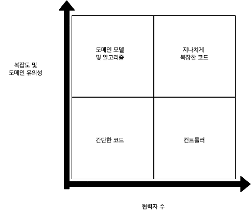

# 가치 있는 단위 테스트 만들기

아래 내용은 유닛 테스트 교재의 6장-7장 내용을 읽고, 단위 테스트의 가치를 최대한 끌어올리는 구조에 대해 정리한 글입니다.

6장에서는 단위 테스트 가치를 최대화 하는 방법과 유지 보수하기에 적합한 코드 구조에 대해서 설명하고, 7장에서는 이러한 구조를 위해 리팩토링하는 내용을 담고 있습니다.

특히 CanExecute/Execute 패턴과 도메인 이벤트 패턴을 활용하여 비즈니스 로직에서 협력자를 최소화하여 비즈니스에 대한 로직을 캡슐화하는 자세한 방법을 알려줍니다.

미래의 제가 또는 이 글을 읽는 분이 더 쉽게 내용들을 이해할 수 있게, 내용을 정리하고 이를 뒷받침하는 간단한 코드 예시를 포스팅했습니다.

# 단위 테스트하기 좋은 구조란?

단위 테스트의 가치가 가장 높을때는, 도메인 로직에 협력자가 적고 비즈니스 가치가 높으며 복잡한 경우 입니다.

매우 단순한 로직은 테스트 가치가 낮습니다. 이러한 낮은 테스트 가치의 코드를 만드는것은, 만들지 않는것보다 못합니다.

우리는 대부분 데이터베이스를 사용하기 때문에, 도메인 로직에서 협력자를 최소화하려면 아래와 같은 흐름이 이상적입니다.

"조회 -> 비즈니스 로직 -> (결과를 바탕으로) 저장"

하지만 실무에서의 비즈니스는 위와 같이 단순하게 흘러가지 않습니다.

# 문제 상황

단위 테스트의 편익이 가장 높은 코드는 좌상단에 존재하는 코드입니다.  



하지만 실무에서는 “조회 → 비즈니스 로직 → (결과를 바탕으로) 다시 조회 → 또 다른 비즈니스 로직 → 저장” 같은 복잡한 흐름이 등장합니다.

한 메서드(또는 한 트랜잭션) 안에서 계속해서 조회와 비즈니스 로직 실행이 섞이면,

- 트랜잭션 경계가 커지고,
- 외부 의존성과 도메인 로직이 복잡하게 얽혀,
- 단위 테스트 편익이 높은 도메인 모델에 대한 테스트가 어려워집니다.

# 해결 아이디어

이를 개선하려면, 의사결정(협력자 의존 단계와 실행(순수 도메인 로직) 단계를 분리해야 합니다.

- CanExecute(의사결정) 단계: 외부 시스템에 의존해 **실행 가능 여부**를 판단하고 필요한 정보를 가져온다.
- Execute(실행) 단계: 의사결정 단계에서 확보한 정보로 순수 비즈니스 로직을 수행한다.

또한, 도메인 이벤트(Domain Event) 를 활용해,

- 한 트랜잭션에서 기본 로직을 처리하고,
- 나머지 추가 로직(예: 다시 조회, 부가 작업)은 이벤트 리스너에서 단계적으로 처리할 수 있다.

## CanExecute/Execute 패턴: 협력자 최소화의 핵심

### 외부 의존성 분리와 단계화

- 의사결정 단계에서만 외부 API 호출, DB 조회, 권한 체크, 할인 정책 조회 등을 수행한다.
- 실행 단계에선 이미 결정된 데이터(할인 금액, 쿠폰 정보, 결제 가능 여부 등)로 순수하게 도메인 로직만 처리한다.

이렇게 하면 실행 단계에서 목(Mock) 필요성이 현저히 줄어들고, 단위 테스트를 작성할 때도 협력자를 대거 주입할 필요가 없습니다.

이 방식의 이점을 정리해보면 아래와 같습니다.

- 복잡도 관리
    - 외부 의존성으로 인한 복잡도를 한 곳(의사결정 단계)에서 처리하므로, 실행 단계가 단순해진다.
- 테스트 편의성
    - 실행 단계는 협력자가 거의 없으니, Mock 없이 순수 단위 테스트가 가능하다.
- 명확한 역할 분리
    - 실행 가능 여부를 판단하는 로직과, 도메인 상태를 변경하는 로직이 분리되어 이해하기 쉽다.

아래 코드 예시를 통해서 확인이 가능합니다.

1~3번을 통해서 협력자를 통해 조회, 실행 가능 여부를 확인하는 코드를 한 곳에 모아둡니다.

그리고 실행 코드를 분리함으로써, 실행시에는 비즈니스 로직만 존재하고 외부 협력자가 필요없도록 구성합니다.

```java
// Controller: /orders/{orderId}/execute
@PostMapping("/orders/{orderId}/execute")
public OrderResponse execute(@PathVariable Long orderId,
                             @RequestBody ExecuteRequest request) {
    
    // 1번 ~ 3번까지 CanExecute
    // 1) 주문을 조회
    Order order = orderRepository.findById(orderId)
            .orElseThrow(() -> new OrderNotFoundException(orderId));

    // 2) 할인율, 쿠폰 정보 등 추가 조회 & 계산
    Discount discount = discountService.getDiscount(order);
    Coupon coupon = couponService.getBestCoupon(order);

    // 3) 주문 상태 검증 (canExecute 로직)
    if (!order.isPending()) {
        throw new OrderExecutionException("주문을 실행할 수 없는 상태입니다.");
    }

    // Execute
    // 4) 실제로 할인, 쿠폰 적용 등 로직 실행
    order.applyDiscount(discount);
    order.applyCoupon(coupon);

    // 저장 단계
    orderRepository.save(order);

    return new OrderResponse(order);
}
```

## 도메인 이벤트로 복잡한 흐름 쪼개기

### 복잡한 구조를 단계로 분할

가령 주문 할인 적용 → 쿠폰 조회 → 쿠폰 적용 같은 시나리오에서, 모든 로직을 한 번에 실행하면 "조회 → 비즈니스 로직 → 다시 조회 → 또 다른 로직 → 저장"이 되면서 트랜잭션이 커지고 테스트도
어려워집니다.

이를 도메인 이벤트로 단계화하면,

- 첫 번째 트랜잭션에서 할인 적용만 처리하고, 할인 적용 이벤트를 발행한다.
- 이벤트 리스너가 이를 받아 다시 쿠폰 조회 등 추가 로직을 수행해, 쿠폰 적용이 필요한 경우 쿠폰 적용 이벤트를 재발행한다.

이처럼 트랜잭션 경계를 명확히 나누고, 각 단계에 필요한 조회와 로직만 수행하도록 만들면, 한 덩어리 메서드에서 계속 조회를 반복해야 하는 문제를 줄일 수 있습니다.

이로써 다시 각 클래스에서 로직의 흐름이 "조회 -> 비즈니스 로직 -> 저장" 와 같이 흘러갈 수 있게 되며, 단위 테스트의 품질을 올릴 수 있습니다.

### 예시 코드 흐름

#### 주문 이벤트 쌓기

```java
@Entity
public class Order {
@Transient
private List<DomainEvent> domainEvents = new ArrayList<>();

    public void applyDiscount(int discount) {
        // 할인 로직
        this.finalAmount = this.totalAmount - discount;
        // 이벤트 등록
        domainEvents.add(new DiscountAppliedEvent(this.id, discount));
    }

    public void applyCoupon(int couponDiscount) {
        this.finalAmount -= couponDiscount;
        domainEvents.add(new CouponAppliedEvent(this.id, couponDiscount));
    }

    public List<DomainEvent> getDomainEvents() {
        return domainEvents;
    }

    public void clearDomainEvents() {
        domainEvents.clear();
    }

}
```

#### 서비스 계층에서 트랜잭션 진행 후 이벤트 발행

```java
@Service
public class OrderService {
        @Transactional
    public void applyDiscountToOrder(Long orderId, int discount) {
        Order order = orderRepository.findById(orderId).orElseThrow(() -> new RuntimeException("Not found"));
        
        order.applyDiscount(discount);
        
        // 이벤트 발행
        List<DomainEvent> events = order.getDomainEvents();
        order.clearDomainEvents();
        events.forEach(eventPublisher::publishEvent);
    }
}
```

#### 이벤트 리스너(쿠폰 적용 등 추가 작업)

```java
@Component
public class DiscountAppliedEventListener {
    @TransactionalEventListener
    public void handleDiscountApplied(DiscountAppliedEvent event) {
        // 1. 다시 조회
        Order order = orderRepository.findById(event.getOrderId()).get();
        // 2. 쿠폰 조회 후 적용
        int couponDiscount = couponRepository.findAvailableCouponDiscount(order);
        order.applyCoupon(couponDiscount);

        // 3. 새 이벤트가 생겼다면 다시 발행
        List<DomainEvent> newEvents = order.getDomainEvents();
        order.clearDomainEvents();
        newEvents.forEach(eventPublisher::publishEvent);
    }
}
```

# 결론

단위 테스트의 가치는 코드 구조에 따라 크게 달라집니다. 

CanExecute/Execute 패턴과 도메인 이벤트를 활용하면 복잡한 의존성을 분리하고, 테스트 가능한 순수 비즈니스 로직(함수)을 유지할 수 있습니다. 

이는 테스트의 유지보수성을 높이고, 코드의 가독성을 향상시킵니다

- CanExecute/Execute 패턴
  - 외부 의존성(협력자)이 필요한 의사결정 단계와, 순수 도메인 로직만 수행하는 실행 단계를 명확히 분리해 테스트하기 쉽고 변화에 강한 구조를 만든다.
- 도메인 이벤트 
  - 한 번의 큰 "조회 -> 로직 -> 조회 -> 로직 -> 저장" 과정 대신, 각 로직이 끝날 때 이벤트를 발행하고
  - 이벤트 리스너가 다음 단계(다시 조회, 추가 로직 적용 등)를 맡아 처리한다.
  - 이렇게 여러 단계를 세분화하면, 트랜잭션 경계를 줄일 수 있고, 각 도메인 별로 "조회 -> 로직 -> 저장"를 유지할 수 있다.

