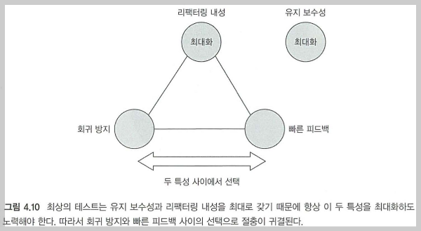

# 단위 테스트(블라디미르 코리코프) 책 리뷰

# 개요

서버 개발을 시작한 뒤로, 단위테스트가 중요하다는 이야기는 너무 많이 들었는데요.

제가 들었던 이야기는 대부분 아래와 같았습니다.

`초반에는 잘 모르겠지만, 테스트 코드가 존재해야지만 시스템이 복잡해지고 비지니스가 발전했을 때, 신규 기능을 마음 놓고 개발 할 수 있다.`

`따라서 단위 테스트 코드는 무조건 작성해야 한다.`

하지만 실제로 내가 작성하는 단위 테스트가 시스템의 품질을 향상 시키고 있는게 맞는지 의심스러울 때가 많았습니다.

마침 테스트 관련 유명한 책 하나를 추천 받아서 읽어봤고 내용이 실용적인 부분들이 존재해서 정리해봤습니다.

# 내용 요약
## 1장)
처음엔 모를 수 있지만, 코드는 시간이 갈 수록 나빠진다. 이를 방지하기 위해서 지속적인 리팩토링과 회귀 방지를 위한 테스트 코드가 필요하다. 
회귀 방지란? 신규 피처로 인해서 기존 피처에서 장애가 발생하는것을 방지하는것을 의미
가치 있는 테스트 코드만 남겨두고, 나머지는 모두 제거해야한다. 코드는 자산이 아니라 부채라서 많을수록 안좋다. 이는 테스트 코드도 마찬가지이다. 결국 가치있는 테스트 코드만을 작성하는게 중요하다.

## 2장)
### mock vs stub
Mockito의 mock을 사용해서 행동을 검증하면 목, 상태를 검증하면 스텁이라고 한다.

### 목
- 행동을 검증하는것
- 흔히 사용하는 Mockioto 의 verify

### 스텁
- 상태를 검증하는것
- 흔히 사용하는 Mockito 의 every / return
 
테스트하고자하는 대상을 SUT(System Under Test)라고 부른다.

목을 사용하게되면 SUT의 세부 구현에 테스트 코드가 의존하게 된다. 

이는 상용 코드를 조금만 수정해도 테스트 코드가 와장장 깨지게 한다. 

결국에 나중에는 상용 코드를 리팩토링하려다가 테스트 코드 수정하는게 두려워서 못한다.

결론은 커맨드 명령에 대한 검증이 아닌 이상, 웬만해서는 verify 쓰지마라

## 3장)
모든 테스트 코드는 준비, 실행, 검증을 따라야 한다. (AAA 패턴)

실행 테스트 코드는 한 줄 이상되면 안된다.

### 통합 테스트
통합 테스트의 경우 해당 에플리케이션만 사용하는 외부 시스템(예를 들어 디비)는 의존성으로 포함하지만, 다른 외부 서비스(예를 들어 타 팀 서버)는 의존성으로 포함하지 않는다.

### 엔드 투 엔드 테스트
모든 의존성을 포함한다.

## 4장) 좋은 단위 테스트의 4대 요소 (중요)

편익이 높은 테스트 코드만 작성해야한다.

아래는 4가지 특성의 곱이 테스트 코드의 가치이다.

### 좋은 단위 테스트의 특성 4가지
- 회귀 방지
  - 신규 피처에 대한 다른 피처의 버그 발생을 얼마나 잘 잡아내는지 (
- 리팩토링 내성 
  - public method의 변경 없이 private method만을 리팩토링 했을 때, 테스트 코드가 실패하는지 (거짓 양성이 발생하는지)
- 빠른 피드백 
  - 테스트 코드가 빨리 실행되는지
- 유지 보수성 
  - 관리하기가 얼마나 쉬운지, 테스트 코드가 잘 읽히는지

위 4가지 특성을 모두 만족하는 테스트 코드는 안타깝게도 없다.

테스트의 가치는 4가지 특성의 곱이다.

눈여겨 봐야할 것은, 리팩토링 내성이다.

리팩토링 내성은 0 아니면 1 뿐이다. 

즉 적당히 존재하는 경우는 없으므로, 리팩토링 내성을 가장 우선시하고 타협하지 않는다. (리팩토링 내성이 0이면, 테스트 가치가 0 이므로..)

리팩토링 내성을 올리기 위해서는 블랙박스처럼 메소드의 출력물에 대한 검증만이 필요하다. 테스트 대상 클래스(SUT)의 상태가 어떻고 저렇고는 검증하면 안된다.

물론 검증하면 회귀 방지는 올라갈 수 있지만 리팩토링 내성과 유지 보수성은 최악이 된다.

비지니스 가치가 있는 동작에만 단위 테스트 코드를 만들어라.

엔드 투 엔드 테스트는 회귀 방지 점수는 높지만 빠른 피드백과 유지 보수성에서 점수가 낮다.

단위 테스트는 빠른 피드백 점수는 높지만 회귀 방지에 대한 점수가 낮다.

일반적으로는 엔드 투 엔드 테스트 갯수 < 통합 테스트 갯수 < 단위 테스트 갯수 이어야 한다.

비지니스 규칙이 매우 단순한 코드는 단위 테스트가 큰 의미가 없고, 통합 테스트가 가치가 있다.

## 5장) 목과 테스트 취약성
CQRS에 따라서 C는 행위(verify)로만 검증하고 Q는 출력만 검증한다.

웬만하면 목을 사용하지 말고, 외부 시스템과의 통신만 목을 사용해라. 목을 사용하는 순간, 리팩토링 내성에 취약한 테스트 코드가 만들어진다.

즉 의존성을 전부 실제 인스턴스로 넣어라.

## 6-7장) 개발자에게 도움이 되는 테스트 만들기 (중요)

[(내용 정리)](https://mj950425.github.io/book/unittest-chapter7/)를 통해서 더 자세하게 정리해두었습니다.

그래서 어떻게하면 목을 덜 사용할 수 있도록 코드를 만들 수 있을까?

아래와 같은 구조를 유지한다.

`조회 -> 비즈니스 로직 -> (결과를 바탕으로) 저장`

위와 같이 구성하면 비지니스 로직에 대한 부분들에서는 협력자가 필요가 없다.

따라서 가장 테스트 편익이 큰 부분에서 목을 쓸 필요도 없어진다.

하지만 실무에서는 아래와 같은 경우가 대부분이다.

조회 → 첫번 째 비지니스 로직 → 첫번 째 비지니스 로직 결과를 바탕으로 다시 조회 → 두번째 비지니스 로직 → 저장

이를 해결하기 위해서, 첫번 째 비지니스 로직 이후에 저장하고 도메인 이벤트를 발행해서 두번 째 비지니스 로직을 분리해라.

이를 통해서 아래 처럼 구성한다.

A 서비스에서 조회 → 비지니스 로직 → 저장 및 이벤트 발행

B 서비스에서 이벤트 컨숨 → 조회 → 비지니스 로직 → 저장

이렇게 하면 비지니스 로직 부분에서는 협력자들을 최소화 할 수 있다.

아니면 SRP 원칙에 따라서 비지니스 로직의 책임이 클래스별로 적절한지 확인해라.

도메인 레이어에서 A 클래스가 B 클래스를 의존받아 A 메소드안에서 B 메소드를 수행한다면 SRP에 따라 클래스 분리가 잘 안되었을 가능성이 높다.

외부 서비스에서 B 클래스의 메소드를 수행하고 그 값을 A 메소드에 넘기면 의존성이 사라질 수 있다.

## 8장) 통합 테스트
통합 테스트 할때는 DB는 개발자들 노트북에 디비를 띄워서 테스트하도록 설정한다.

나머지 외부 서버에 대한 의존성은 목으로 처리한다.

서비스 클래스에 대한 테스트는 통합 테스트로 처리한다.

OCP 웬만하면 사용하지말아라. 프레임워크 만들때만 써라 

관련 래퍼런스 :https://enterprisecraftsmanship.com/posts/ocp-vs-yagni/

## 9장) 목 처리에 대한 모범 사례
단위 테스트에서는 목을 사용하지말아라. 통합 테스트에서 비관리 외부 의존성(디비 같은 것 말고 타 팀의 외부 서버를 의미)에서만 목을 써라

## 10장) 데이터 베이스 테스트
통합 테스트 할때는 DB는 개발자들 노트북에 디비를 띄워서 테스트하도록 설정한다.

테스트 시작 단계에 데이터 지워줘라. 그래야 안헷갈린다.

통합 테스트는 웬만하면 병렬 실행하려고하지마라

## 11장) 단위 테스트 안티 패턴
비공개 메소드는 테스트하지마라

비공개 접근 제어자를 테스트 때문에 공개로 변경하지마라

그냥 아예 테스트랑 상용 코드랑 엮으려고 하지마라

# 실용적인 내용 요약
- 비지니스 가치가 없는 동작은 단위 테스트 코드로 작성하지 말것
- 단순한 CRUD는 테스트를 하지않거나, 통합 테스트로 검증할 것
- 최대한 도메인 로직에는 협력자를 제거하는 방향으로 코드를 작성한다. (험블 패턴 참고) 이것은 단위 테스트의 품질을 올려줄 뿐만 아니라, 상용 코드가 SRP 원칙을 더 잘 지킬 수 있게 도와준다.
- 통합 테스트를 작성할때는 테스트 컨테이너를 사용해서 테스트 별로 컨테이너를 새롭게 띄울 것
- 프레임워크 만들거 아니며 인터페이스에 대한 구현체가 지금 당장 여러개인 것도 아니면서, 테스트 mock을 만들것이 아니라면, OCP 쓰지마라 (저자 포스팅:https://enterprisecraftsmanship.com/posts/ocp-vs-yagni/)
