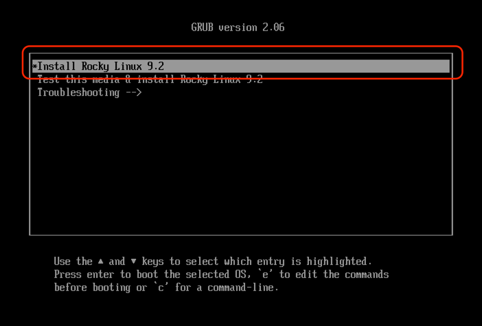

# 로컬환경에 쿠버네티스를 설치하는 방법
[인프런의 쿠버네티스 어나더 클래스 (지상편) - spring 1,2](https://www.inflearn.com/course/%EC%BF%A0%EB%B2%84%EB%84%A4%ED%8B%B0%EC%8A%A4-%EC%96%B4%EB%82%98%EB%8D%94-%ED%81%B4%EB%9E%98%EC%8A%A4-%EC%A7%80%EC%83%81%ED%8E%B8-sprint1/dashboard) 를 수강하면서 쿠버네티스 클러스터의 설치 과정을 조금 더 세부적으로 정리해봤습니다.

제가 사용하고 있는 노트북의 환경은 아래와 같습니다.

macbook pro 16
- cpu : apple m3 pro
- memory : 36gb
- os : sonoma 14.3

최종적으로 만들어지는 구성도는 아래와 같습니다.


## Linux ISO를 다운로드

먼저 Rocky Linux ISO를 다운로드한다. 우선은 파일을 받기만한다.

- Download : https://dl.rockylinux.org/vault/rocky/9.2/isos/aarch64/Rocky-9.2-aarch64-minimal.iso

## UTM 설치

UTM은 맥에서 사용하는 virtual box라고 이해하면 된다.

UTM은 QEMU 기반으로 apple silicon과 같은 arm 아키텍처에서 원할하게 작동한다.

반면 virtual box는 x86/x64 아키텍처에서 동작한다.

- Download : https://github.com/utmapp/UTM/releases/download/v4.4.4/UTM.dmg

## 리눅스 설치

새 가상머신 만들기를 클릭한다.


virtualize를 선택한다.


Linux를 선택하고, 아래 이미지처럼 탐색을 누르고 다운받았었던 Rocky Linux ISO를 선택한다.


메모리는 4906MB, CPU 코어는 4개로, 스토리지는 32GB로, 공유폴더는 설정하지 않는다.


그러면 summary가 등장하는데, name을 k8s-master로 변경하고, open vm settings를 클릭한뒤, 저장한다.


그러면 새로운 팝업이 뜨는데, 네트워크를 누르고, 고급 설정을 클릭하고 게스트 네트워크에 192.168.56.0/24를 입력한 뒤, 저장한다.


그러면 팝업이 닫히고, 다시 UTM 화면으로 돌아가서 Rocky Linux 가상머신을 실행시킨다.



한국어로 설정하고, 사용자 설정에 있는 root 비밀번호 수정해준다.


그리고 시스템의 설치 목적지를 클릭한 뒤, 자동 설정이 체크되어있는지 확인하고 완료를 눌러준다.


다시, 시스템의 네트워크와 호스트 이름을 클릭한다. 그리고 이더넷(enp0s1)에 대한 설정을 클릭한다.

그리고 IPv4 설정을 클릭하고, add를 눌러서 아래를 입력해준다.

주소(192.168.56.30), 넷마스크(255.255.255.0), 게이트웨이(192.168.56.1)

그리고 저장을 누른다.


호스트 이름을 변경하고, ip주소와 게이트웨이 주소가 잘 저장됐는지 한번 확인한 뒤, 완료를 누른다.


그리고 설치 시작을 누르고, 설치가 완료되면 시스템 재시작 버튼을 누른다.

그러면 아래처럼 다시 리눅스를 설치하라는 화면이 나오는데, shutdown을 눌러준다.


그리고 UTM화면에서 CD/DVD의 화살표를 클릭하고 초기화를 눌러준다. 그러면 (empty) 라는 문구가 오른쪽에 노출된다.


이 상태에서 VM을 다시 실행시킨다.

## 맥북에서 ssh 접속

가상환경의 터미널은 복사와 붙여넣기가 안되기 떄문에 최소화 시키고, 맥북의 터미널을 실행시킨다.

```
ssh root@192.168.56.30
```

만약에 리눅스를 재설치했다면, ssh-keygen -R 192.168.56.30를 통해서 키를 한번 지워주고 다시 실행한다.


## 쿠버네티스 설치

### 타임존 설정

쿠버네티스 클러스터의 각 노드가 동일한 시간을 유지하도록 타임존을 설정해야한다.

각 노드별로 시간이 다르면 로그가 뒤죽박죽 찍히고, 리소스 업데이트가 부정확해질 수 있다.

```
timedatectl set-timezone Asia/Seoul
```

timedatectl를 입력해서 System clock synchronized: yes 임을 확인한다.


### kubeadm 설치 전 사전 작업

kubeadm은 Kubernetes 클러스터를 쉽게 생성하고 관리할 수 있도록 도와주는 도구이다.

Kubernetes는 매우 복잡한 시스템이기 때문에, 여러 컴포넌트(API 서버, 스케줄러, 컨트롤러 매니저, etcd 등)를 하나하나 설치하고 설정하기가 어렵다.

kubeadm은 이러한 복잡한 설정을 자동화하여, Kubernetes 클러스터를 쉽게 구성하고 부트스트랩하는 도구이다.

#### 방화벽 해제

방화벽이 활성화되어 있으면 클러스터 내부의 네트워크 통신에 문제가 발생할 수 있기 때문에 비활성화한다.

```
systemctl stop firewalld && systemctl disable firewalld
```

#### swap 비활성화

Kubernetes는 메모리 스왑이 활성화된 시스템에서 예기치 않은 성능 문제가 발생할 수 있기 때문에, swap을 비활성화해야 한다.

```
swapoff -a && sed -i '/ swap / s/^/#/' /etc/fstab
```

### 컨테이너 런타임 설치

#### iptable 셋팅

쿠버네티스 마스터 노드가 부팅시에 커널의 특정 모듈을을 자동으로 로드하도록 설정한다.

- overlay: 컨테이너 이미지에서 파일 시스템을 효율적으로 관리하기 위한 커널 모듈
- br_netfilter: 네트워크 브리지에서 필터링을 지원하며, Pod 간의 네트워크 트래픽을 관리하는 데 필요

```
cat <<EOF |tee /etc/modules-load.d/k8s.conf
overlay
br_netfilter
EOF
```

컨테이너 이미지의 파일 시스템을 관리하는 모듈을 즉시 로드한다.

```
modprobe overlay
```

Pod 간의 네트워크 트래픽을 관리하는 모듈을 즉시 로드한다.

```
modprobe br_netfilter
```

파드들이 같은 워커 노드가 아니라, 다른 워커 노드에 분산될 수 있다. 이 경우 노드간 네트워크를 통한 통신이 필요하다.

이 때, iptable은 노드 안의 특정 파드가 실제로 어떤 포트를 사용하는지 숨기는 NAT 역할을 한다.

아래는 네트워크 브릿지에서 흐르는 트래픽을 iptable을 거치도록 설정한다.

```
cat <<EOF |tee /etc/sysctl.d/k8s.conf
net.bridge.bridge-nf-call-iptables  = 1
net.bridge.bridge-nf-call-ip6tables = 1
net.ipv4.ip_forward                 = 1
EOF
```

변경된 커널 파리미터를 적용한다.

```
sysctl --system
```

#### containerd (컨테이너 런타임) 설치

containerd와 같은 컨테이너 런타임 패키지를 제공해주는 도커 레포지토리를 yum에 등록한다.

```
yum-config-manager --add-repo https://download.docker.com/linux/centos/docker-ce.repo
```

등록한 도커 레포지토리에서 containerd를 설치한다.

```
yum install -y containerd.io-1.6.21-3.1.el9.aarch64
```

containerd가 가지는 기본 설정값을 커스텀할 수 있게, /etc/containerd/config.toml에 저장한다.

```
containerd config default > /etc/containerd/config.toml
```

containerd가 사용하는 cgroup을 systemd로 관리하게 설정합니다.

```
sed -i 's/ SystemdCgroup = false/ SystemdCgroup = true/' /etc/containerd/config.toml
```

containerd 서비스를 재시작한다.

```
systemctl restart containerd
```

### kubeadm 설치

yum 리포지토리를 설정하여 Kubernetes 관련 패키지를 다운로드할 수 있는 소스를 지정한다.

```
cat <<EOF | sudo tee /etc/yum.repos.d/kubernetes.repo
[kubernetes]
name=Kubernetes
baseurl=https://pkgs.k8s.io/core:/stable:/v1.27/rpm/
enabled=1
gpgcheck=1
gpgkey=https://pkgs.k8s.io/core:/stable:/v1.27/rpm/repodata/repomd.xml.key
exclude=kubelet kubeadm kubectl cri-tools kubernetes-cni
EOF
```

SELinux(Security-Enhanced Linux)는 리눅스 커널에서 제공하는 보안 모듈이다.

Kubernetes는 SELinux가 enforcing 모드에서 동작하면 일부 제약이 생기므로 이를 permissive 모드로 변경한다.

```
setenforce 0
```

```
sed -i 's/^SELINUX=enforcing$/SELINUX=permissive/' /etc/selinux/config
```

Kubernetes 패키지를 설치한다.
- kubelet: Kubernetes 클러스터에서 Pod를 실행하고 관리하는 노드 에이전트
- kubeadm: Kubernetes 클러스터 초기화 및 관리 도구로, 클러스터 생성과 구성에 필요한 명령어들을 제공하는 도구
- kubectl: Kubernetes CLI로, 클러스터와 상호작용하고 리소스를 관리할 수 있는 명령어

```
yum install -y kubelet-1.27.2-150500.1.1.aarch64 kubeadm-1.27.2-150500.1.1.aarch64 kubectl-1.27.2-150500.1.1.aarch64 --disableexcludes=kubernetes
```

kubelet 서비스를 활성화하고, 시스템 부팅 시 자동으로 시작되도록 설정한다.

```
systemctl enable --now kubelet
```

클러스터를 초기화한다.

- kubeadm init : 마스터 노드를 초기화하고 Kubernetes 클러스터를 설정한다.
- --pod-network-cidr=20.96.0.0/16: Pod 네트워크에 할당할 IP 대역을 지정한다. 이 네트워크 범위는 이후 CNI 플러그인(Calico 등)과 연결된다.
- --apiserver-advertise-address=192.168.56.30: Kubernetes API 서버가 사용할 IP 주소를 지정한다. 다른 노드들이 이 API 서버를 통해 마스터 노드와 통신하게 된다.

```
kubeadm init --pod-network-cidr=20.96.0.0/16 --apiserver-advertise-address 192.168.56.30
```

kubectl 설정 파일을 저장할 디렉토리를 생성한다.
```
mkdir -p $HOME/.kube
```

관리자 권한의 클러스터 설정 파일을 kubectl이 사용할 수 있도록 복사한다.
```
cp -i /etc/kubernetes/admin.conf $HOME/.kube/config
```

설정 파일의 소유권을 현재 사용자로 변경한다.
```
chown $(id -u):$(id -g) $HOME/.kube/config
```

Calico는 Kubernetes 클러스터에서 Pod 간 네트워크 통신을 관리하는 CNI 플러그인이다.
```
kubectl create -f https://raw.githubusercontent.com/k8s-1pro/install/main/ground/k8s-1.27/calico-3.26.4/calico.yaml
kubectl create -f https://raw.githubusercontent.com/k8s-1pro/install/main/ground/k8s-1.27/calico-3.26.4/calico-custom.yaml
```

기본적으로 Kubernetes는 마스터 노드에서 Pod가 실행되지 않도록 설정되어있다. 

이는 마스터 노드가 클러스터 관리에만 집중하도록 하기 위함입니다.

학습 목적이므로 마스터 노드의 taint를 제거하여 마스터 노드에서도 Pod를 실행할 수 있게한다.
```
kubectl taint nodes k8s-master node-role.kubernetes.io/control-plane-
```

### 편의 기능 설치

kubectl 자동완성 기능을 설치한다.
```
yum -y install bash-completion
echo "source <(kubectl completion bash)" >> ~/.bashrc
echo 'alias k=kubectl' >>~/.bashrc
echo 'complete -o default -F __start_kubectl k' >>~/.bashrc
source ~/.bashrc
```

대시보드를 설치한다.
```
kubectl create -f https://raw.githubusercontent.com/k8s-1pro/install/main/ground/k8s-1.27/dashboard-2.7.0/dashboard.yaml
```

메트릭 서버를 설치한다.
```
kubectl create -f https://raw.githubusercontent.com/k8s-1pro/install/main/ground/k8s-1.27/metrics-server-0.6.3/metrics-server.yaml
```

# 래퍼런스

자세한 내용은 일프로 카페 https://cafe.naver.com/kubeops/91 에서 확인할 수 있다.

